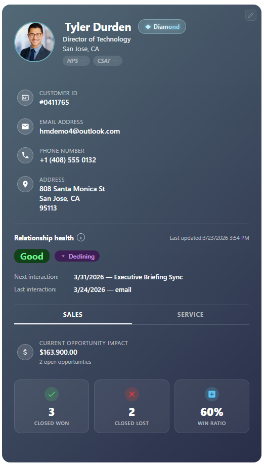
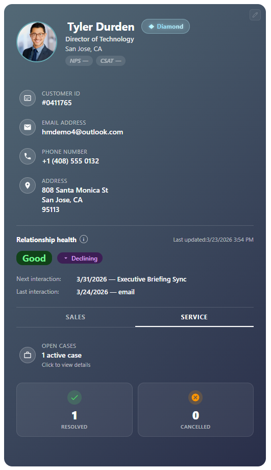
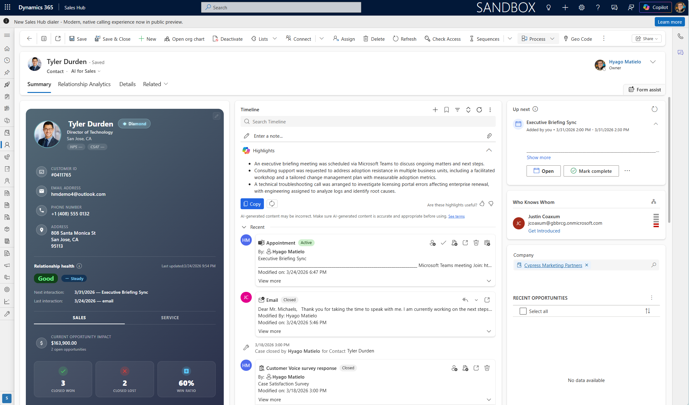

# Contact 360 Profile Card for Dynamics 365

A rich, visual contact profile card designed to be embedded directly inside Microsoft Dynamics 365 Sales forms. It gives sales reps and account managers a **single-glance view** of everything they need to know about a contact — right on the record.

## Screenshots

| Sales Tab | Service Tab |
|:---------:|:-----------:|
|  |  |

### Embedded in Dynamics 365

## What It Does

When you open a Contact record in Dynamics 365, this card appears and automatically displays:

- **Contact photo & name** — with the ability to upload or change the photo directly from the card.
- **Loyalty tier pill** — Diamond, Gold, and Silver tiers displayed as an animated shimmer badge next to the contact name.
- **Role line with account context** — shows the contact's job title and, when available, the parent account name as a clickable link that opens the Account record.
- **Key details** — email, phone, and address with inline editing.
- **NPS & CSAT scores** — quick satisfaction indicators shown as header pills.
- **Relationship Health** — powered by Dynamics 365 Sales Insights, showing the current health status (Good / Fair / Poor), trend direction (Improving / Steady / Declining), and the next and last scheduled interactions.
- **Sales tab** — current opportunity impact, open opportunities (clickable), closed won/lost counts, and win ratio.
- **Service tab** — open cases, resolved and cancelled case counts, with clickable case details.

### Visual Highlights

- **Loyalty tier badges** — Diamond, Gold, and Silver tiers each have their own animated shimmer effect.
- **Color customization** — a built-in color picker lets you personalize the card's background and text colors.
- **Inline editing** — click on any editable field to update it directly, without leaving the card. Changes save back to Dynamics 365 instantly.
- **Clickable navigation** — click the parent account, opportunities, or cases to open them directly in Dynamics 365.

## How to Use It

1. **Upload as a Web Resource** — in your Dynamics 365 environment, go to **Settings → Customizations → Web Resources** and create a new HTML web resource using the `c-360.html` file.
2. **Add to the Contact Form** — open the Contact main form in the form editor, add a **Web Resource** control, and point it to the web resource you just created.
3. **Publish** — save and publish the form. The card will appear automatically whenever someone opens a Contact record.

No additional servers, databases, or installations are required. Everything runs inside Dynamics 365 using the built-in Web API.

## Requirements

- Microsoft Dynamics 365 Sales (online)
- The custom fields referenced in the card (for example Loyalty Tier, NPS, and CSAT) must exist on the Contact entity in your environment
- For Relationship Health data, **Sales Insights** must be enabled in your Dynamics 365 environment
